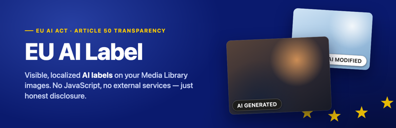
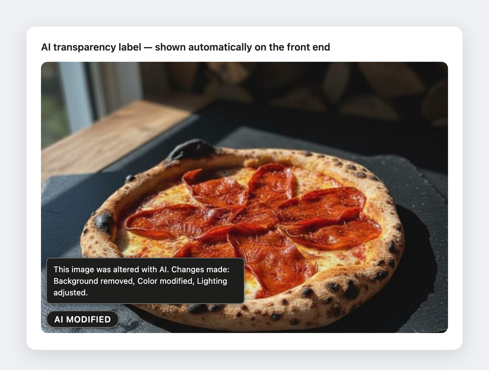

  

# EU AI Label

**Visible, localized AI transparency badges for your WordPress Media Library — in the spirit of EU AI Act Article 50.**

Flag any image in your Media Library as **AI generated** or **AI modified**, and visitors instantly see a clean, high-contrast badge on the front end. Built for EU WooCommerce stores that want a simple, honest way to disclose AI product imagery — no C2PA, no cryptography, no external services. Just a clear visual mark plus attachment metadata.

  

## How it works

1. Install and activate — there is nothing to configure.
2. Open any image in the Media Library and set its **AI label**: *AI generated*, *AI modified*, or *No AI*.
3. Done. Labeled images are badged automatically everywhere they appear — featured images, galleries, and in-content Image blocks.

The badge is rendered server-side (no front-end JavaScript), accessibility-first (always visible, `role="img"` with a screen-reader label, readable minimum size), and automatically localized — English, Polish, German, French, Spanish, Italian, and Dutch. Its wording and pill shape mirror the EU standardized AI labels.

## Free vs Pro

The free plugin is a complete disclosure tool for a small site. [**EU AI Label Pro**](https://euailabel.app/) is built for stores that label imagery at scale — and need to prove it.

| | Free | **Pro** |
|---|---|---|
| Labeled images | Up to 10 | **Unlimited** |
| Accessibility-first localized badge | ✅ | ✅ |
| Featured, gallery & in-content coverage | ✅ | ✅ |
| Adaptive badge (auto light/dark per image) | — | ✅ |
| Bulk labeling from the Media Library (list & grid) | — | ✅ |
| "How it was altered" tooltip (e.g. *background removed*) | — | ✅ |
| Tamper-evident audit log (who/what/when, hash-chain sealed) | — | ✅ |

### Why stores upgrade

- **Unlimited images.** A WooCommerce catalog outgrows 10 labels on day one. Pro removes the cap entirely.
- **Bulk labeling.** Label an entire product shoot in one action instead of opening attachments one by one.
- **An audit trail you can stand behind.** Every label change is recorded — who changed what, and when — and sealed with a hash chain, so the log is tamper-evident. When someone asks *"since when has this been disclosed?"*, you have the answer.
- **Richer disclosure.** Tell visitors *how* an image was altered (background removed, color modified, …) via the badge tooltip.
- **A badge that looks right on every photo.** The adaptive badge switches between light and dark styling per image.

👉 **[Get EU AI Label Pro at euailabel.app](https://euailabel.app/)** — or upgrade right from your WordPress dashboard (*Settings → EU AI Label → Upgrade*). Fair-minded downgrade policy: labels you have already applied always keep working and stay editable, even if you later drop from Pro back to free.

## Installation

**From WordPress.org (recommended):** search for *EU AI Label* in *Plugins → Add New*, or grab it from the [plugin directory](https://wordpress.org/plugins/eu-ai-label/).

**From this repository:** download the zip from the [latest release](https://github.com/eu-ai-act-label-app/eu-ai-act-label-app-wordpress-plugin/releases/latest) and upload it via *Plugins → Add New → Upload Plugin*.

### Requirements

- WordPress 6.5+
- PHP 8.1+

## FAQ

**Does this detect AI images automatically?**
No. Labeling is manual and per-image, by design — you stay in control of exactly what is disclosed.

**Which images get the badge?**
Any labeled image attached from your Media Library: featured images, galleries, and in-content images. Externally hotlinked images and CSS backgrounds have no attachment record, so they cannot be labeled.

**Can I restyle the badge?**
No — the badge ships with a single, fixed, accessibility-first style, localized automatically. This is deliberate: a consistent, high-contrast disclosure cannot be accidentally styled into something illegible.

**Is this legal advice or a compliance guarantee?**
No. EU AI Label helps you disclose AI-generated imagery clearly; it does not constitute legal advice, and using it does not by itself guarantee compliance with the EU AI Act or any other law. Consult a qualified professional about your obligations.

## About this repository

This repository mirrors the **free build** of EU AI Label — the exact code distributed on WordPress.org — published automatically on every release. Development happens in a private repository; Pro code is not included here.

Found a bug or have a feature request? [Open an issue](https://github.com/eu-ai-act-label-app/eu-ai-act-label-app-wordpress-plugin/issues) — we read them all.

## Links

- 🌐 **Website & Pro:** [euailabel.app](https://euailabel.app/)
- 🔌 **WordPress.org:** [wordpress.org/plugins/eu-ai-label](https://wordpress.org/plugins/eu-ai-label/)
- 📦 **Releases:** [installable zips](https://github.com/eu-ai-act-label-app/eu-ai-act-label-app-wordpress-plugin/releases)

## License

[GPLv2 or later](LICENSE). EU AI Label is part of the euailabel.app AI Act toolkit for e-commerce.
